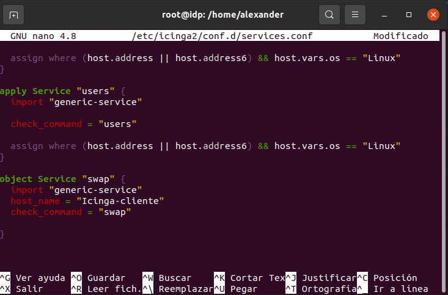

## Primero en el equipo principal ##

Accedemos al archivo  */etc/icinga2/conf.d/hosts.conf* añadiendo la siguiente linea

```bash
object Host "Nombre-cliente" {
    import "generic-host"
    address = "IP-Cliente"
}
```


Para monitorizar algo , en este ejemplo usaremos 'swap' para saber el espacio libre en el swap del equpo linux cliente  Accedemos al archivo  */etc/icinga2/conf.d/services.conf* añadiendo la siguiente linea

```bash
object Service "swap" {
  import "generic-service"
  host_name = "Icinga-cliente"
  check_command = "swap"

}
```



## En el navegador ya nos mostrará el otro equipo ##


# Monitorizar Hardware en Cliente


**Seguiriamos las mismas anotaciones que en el ejemplo anterior**

Accedemos al archivo  */etc/icinga2/conf.d/services.conf* añadiendo la siguiente linea

```bash
object Service "CPU" {
  import "generic-service"
  host_name = "Icinga-cliente"
  check_command = "load"

}
```

```bash
object Service "Almacenamiento" {
  import "generic-service"
  host_name = "Icinga-cliente"
  check_command = "disk"

}
```


## Activar el envio de notificaciones

Si queremos recibir emails con las advertencias o fallos de algun sistema el cual estemos monitorizando hemos de hacer lo siguiente :

Instalamos los paquetes necesarios con el comando :

```bash
sudo apt-get install postfix mailutils
```

Se nos abre alguna ventana de configuracion , en la primera dejamos el valor por defecto de "sitio de internet" en el segundo seria algo como en este ejemplo :


Nos dirijimos al archivo  */etc/icinga2/conf.d/users.conf*  y añadiños en nustro usuario estas lineas :

```bash
 enable_notifications = true
  states = [ OK, Warning, Critical ]
  types = [ Problem, Recovery ]
  email = "ejemplo@ejemplo"
```
Quedando de esta forma 


Despues vamos a */etc/icinga2/conf.d/notifications.conf* para asegurarnos de que nuestra configuracion es correcto , deberiamos tener algo asi : 


Y para acabar en */etc/icinga2/conf.d/host.conf* añadimos al host del que queramos notificarnos :

```bash
 vars.notification["mail"] = {
        groups = [ "icingaadmins" ]
      
```


Al cabo de un rato nos llegara el correo : 


Enlace a la [Guia Para añadir servicios de red a monitorizar](/servicios.md)

Enlace a la [Guia Para Monitorizar sitio web](/cpu.md)